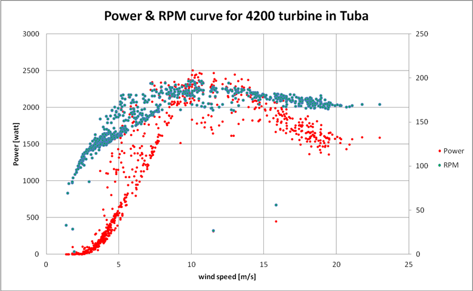

# OpenAFPM Tutorial
[Wind Empowerment Webinar - OpenAFPM tools for designing AFPM generators for Small Wind Turbines
](https://youtu.be/hk0j-qxkG9s?t=1312)

## Comet-ME Case Study

[Comet-ME](https://comet-me.org/) (Community, Energy and Technology in the Middle East), a non-governmental organization (NGO) that designs, builds, installs, and maintains off-grid renewable energy systems in rural areas of the occupied Palestinian territories.

### Design Requirements

1. 4.2 m + 450 mm rotor disks + 48V+ GridTie (WB 150V)
2. 3m + 350 mm rotor disks + 48V + 24v
3. Rectangular coils + 12mm stator thickness + 5mm mechanical clearance
4. N42 46x30x15mm

### Design Goals
1. How many poles in each case? They now use 20 for 4.2m and 12 for 3m.
2. By using the same magnet dimensions and rotor disk dimensions, as they have a stock of these materials.
3. By keep power losses low at 8-12 m/s wind.
4. Suggest an optimized design for the 4.2m turbine.

### Design Process
1. Use MagnAFPM for 4.2m 48V - Start with 20 poles (543-546). 20 poles best as 16 (561, 568) will not fit although they produce a bit more power. 20 poles has 70% eff and 16 poles has 60% eff, but higher TSR and cp so it produceds more power, but it doesn't fit in 450 mm Dout.
2. Once the designs are ready, then use UserAFPM to see the peformance (547).
3. Use MagnAFPM for 4.2m GridTie (571).
4. Use MagnAFPM for 3m 2V - Start with 20 poles (549, 550), then 6 (551, 552), and then 12 (555-558).

### Comet-ME 4.2 N42
Submitted by Kostas on Tue, 17/04/2018 - 04:12
**Simulation type:** MagnAFPM
**Simulation status:** Completed
**Duration:** 00:00:59

1. New Simulation -> MagnAFPM
    * **Title:** Comet-ME 4.2 N42
    * **Turbine radius:** 2.1 
    * **Winding fill factor:** Calculated
    * **Stator thickness:** 12
    * **Magnetic material:** NdFeB N42
    * **Number of generator poles:** 20
    * **Magnet thickness:** 15
    * **Mechanical clearance:** 5
    * **System Voltage:** 48
    * **Nominal Voltage:** 48

